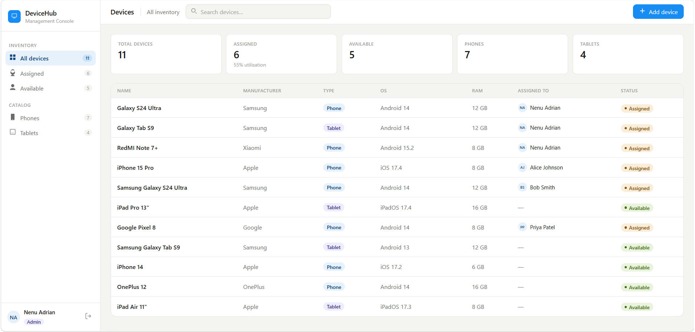
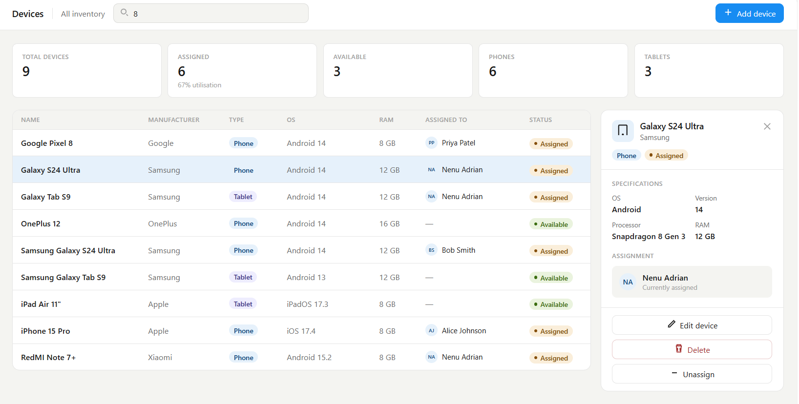
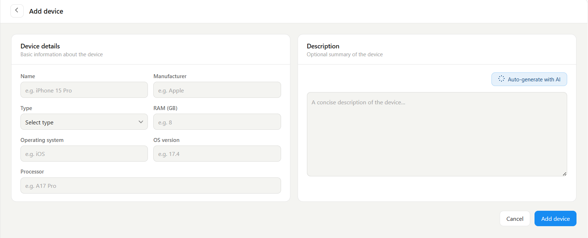
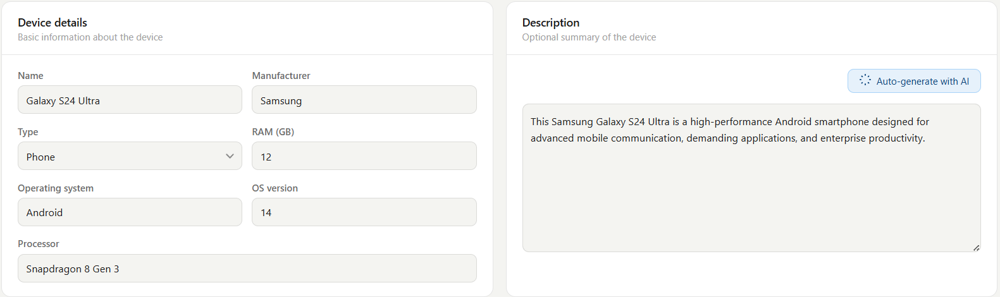
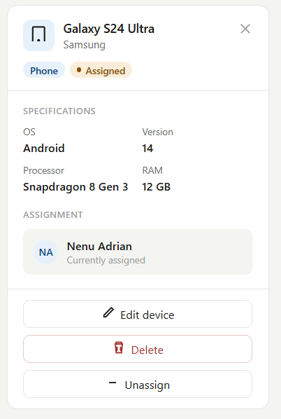
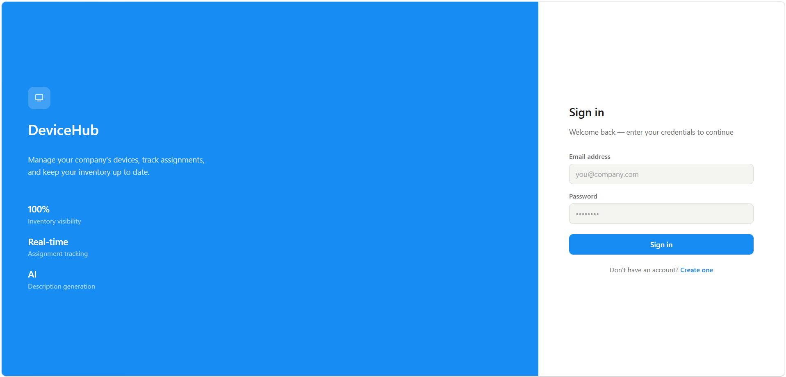
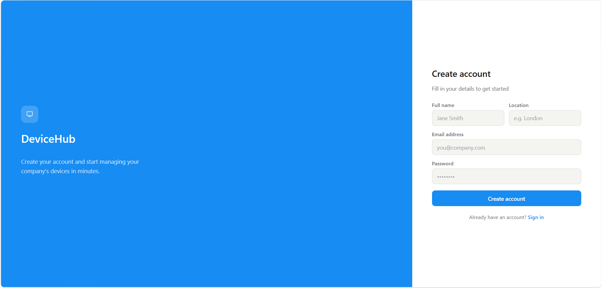
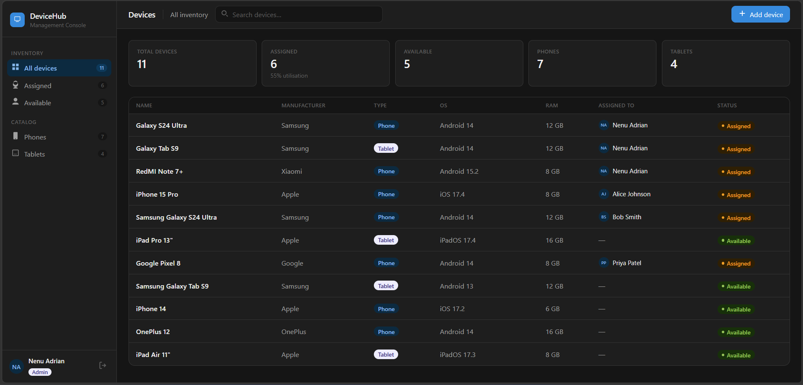

# DeviceHub — Device Management System

A full-stack web application for tracking company-owned mobile devices, managing who has each device, and providing AI-generated descriptions of device specs.



---

## Table of Contents

- [Overview](#overview)
- [Tech Stack](#tech-stack)
- [Project Structure](#project-structure)
- [Features](#features)
- [Prerequisites](#prerequisites)
- [Getting Started](#getting-started)
  - [1. Clone the Repository](#1-clone-the-repository)
  - [2. Set Up the Database](#2-set-up-the-database)
  - [3. Configure the Backend](#3-configure-the-backend)
  - [4. Run the Backend](#4-run-the-backend)
  - [5. Run the Frontend](#5-run-the-frontend)
- [Default Seed Accounts](#default-seed-accounts)
- [API Reference](#api-reference)
- [Architecture Deep Dive](#architecture-deep-dive)
- [Security](#security)
- [Running the Integration Tests](#running-the-integration-tests)
- [Screenshots](#screenshots)

---

## Overview

DeviceHub lets your IT team keep a live inventory of every phone and tablet the company owns. From a single dashboard you can see what each device is, who currently has it, and whether it's available. Employees can claim a device for themselves and release it when done — no spreadsheets needed.

The application is split into three parts that work together:

- **Database** — Microsoft SQL Server stores all device and user data.
- **Backend API** — An ASP.NET Core Web API handles all business logic and exposes a REST interface.
- **Frontend** — An Angular single-page app that employees and managers use in their browser.

---

## Tech Stack

| Layer | Technology |
|---|---|
| Database | Microsoft SQL Server (Express or full) |
| Backend | C# · ASP.NET Core 9 · Entity Framework Core |
| Authentication | JWT stored in an HttpOnly cookie + CSRF protection |
| AI Integration | Google Gemini 2.5 Flash |
| Frontend | Angular 21 · Angular Material · SCSS |
| Testing | xUnit + `WebApplicationFactory` integration tests |

---

## Project Structure

```
device-management/
├── backend/                   # ASP.NET Core Web API
│   ├── Controllers/           # HTTP endpoints (Auth, Devices)
│   ├── Services/              # Business logic (AuthService, AiService)
│   ├── Repositories/          # Database access layer
│   ├── Models/                # Database entity classes (Device, User)
│   ├── DTOs/                  # Data transfer objects (what the API sends/receives)
│   ├── Interfaces/            # Repository contracts
│   ├── Data/                  # Entity Framework DB context
│   ├── Constants/             # Role name constants
│   ├── Program.cs             # App startup and service wiring
│   └── appsettings.json       # Configuration (connection string, JWT, Gemini key)
│
├── frontend/                  # Angular application
│   └── src/app/
│       ├── components/        # UI components (device-list, device-form, login, register)
│       ├── services/          # API communication (device.service, auth.service)
│       ├── guards/            # Route protection (redirects to login if not authenticated)
│       ├── interceptors/      # Automatically attaches credentials to every request
│       ├── models/            # TypeScript interfaces matching the API DTOs
│       └── environments/      # Base API URL config
│
├── db/
│   ├── 01_create_schema.sql   # Creates the database and tables (safe to re-run)
│   └── 02_seed_data.sql       # Populates dummy users and devices (safe to re-run)
│
└── integration-tests/         # End-to-end API tests (no real DB required)
```

---

## Features

### Device Inventory
- View all devices in a sortable table showing name, manufacturer, type, OS, RAM, assigned user, and availability status.
- Click any row to open a detail panel on the right with full specs and available actions.
- Real-time search across device name, manufacturer, processor, and RAM — results are ranked by relevance (name matches rank first).



### Device Management (Manager/Admin only)
- **Add a device** — fill in all specs; the form validates every field and prevents duplicate names.
- **Edit a device** — update any field; the original name is excluded from the duplicate check.
- **Delete a device** — requires a confirmation step directly in the detail panel.
- **AI description generator** — click a button on the form and Gemini automatically writes a professional one-sentence description based on the specs you've entered.




### Device Assignment
- Any logged-in employee can **assign** an available device to themselves with one click.
- The same employee can **unassign** their own device when they no longer need it.
- Managers and Admins can see who has what device but cannot hijack another user's assignment.



### Authentication
- **Register** — create an account with your name, email, password, and office location. All new accounts are given the Employee role.
- **Login / Logout** — session is kept in a secure, HTTP-only cookie that lasts 7 days.




### Role-Based Access
| Action | Employee | Manager | Admin |
|---|:---:|:---:|:---:|
| View all devices | ✅ | ✅ | ✅ |
| Assign / unassign own device | ✅ | ✅ | ✅ |
| Add / edit devices | ❌ | ✅ | ✅ |
| Delete devices | ❌ | ✅ | ✅ |

---

## Prerequisites

Make sure you have these installed before starting:

- [.NET 9 SDK](https://dotnet.microsoft.com/download) — to run the backend
- [Node.js 20+](https://nodejs.org/) and npm — to run the frontend
- [SQL Server Express](https://www.microsoft.com/en-us/sql-server/sql-server-downloads) (or any SQL Server edition) — for the database
- [SQL Server Management Studio (SSMS)](https://aka.ms/ssmsfullsetup) or another SQL client — to run the setup scripts
- A [Google AI Studio](https://aistudio.google.com/) account — to get a free Gemini API key for the AI description feature

---

## Getting Started

### 1. Clone the Repository

```bash
git clone https://github.com/your-username/device-management.git
cd device-management
```

### 2. Set Up the Database

Open SSMS (or your SQL client), connect to your SQL Server instance, and run the two scripts in order:

```
db/01_create_schema.sql   ← creates the DeviceManagement database and tables
db/02_seed_data.sql       ← inserts sample users and devices
```

Both scripts are **idempotent** — you can safely run them more than once without duplicating data.

> **Default instance:** The backend is pre-configured to connect to `localhost\SQLEXPRESS`. If your SQL Server has a different name, update the connection string in the next step.

### 3. Configure the Backend

The backend reads its settings from `backend/appsettings.json`. You need to update two things:

**Connection string** — only change this if your SQL Server instance name differs from `SQLEXPRESS`:

```json
"ConnectionStrings": {
  "DefaultConnection": "Server=localhost\\SQLEXPRESS;Database=DeviceManagement;Trusted_Connection=True;TrustServerCertificate=True;"
}
```

**Gemini API key** — replace `API_KEY_HERE` with your key from [Google AI Studio](https://aistudio.google.com/):

```json
"Gemini": {
  "ApiKey": "your-actual-gemini-api-key"
}
```

**JWT secret** — replace the placeholder with any random string of at least 32 characters:

```json
"Jwt": {
  "Key": "replace-this-with-a-long-random-secret-key"
}
```

> **Tip:** For local development you can also create a `backend/appsettings.local.json` file with just the keys you want to override — this file is loaded automatically and should be added to `.gitignore` so secrets don't end up in version control.

### 4. Run the Backend

```bash
cd backend
dotnet run
```

The API will start on **http://localhost:5142** (or https://localhost:7264 for HTTPS). You'll see a confirmation message in the terminal.

You can browse the full list of API endpoints by visiting **http://localhost:5142/swagger** in your browser.

### 5. Run the Frontend

Open a second terminal window:

```bash
cd frontend
npm install        # only needed the first time
npm start
```

Once compiled, open your browser and go to **http://localhost:4200**.

You'll be redirected to the login page automatically.

---

## Default Seed Accounts

After running the seed script, these accounts are ready to use:

| Name | Email | Password | Role |
|---|---|---|---|
| System Admin | admin@company.com | Admin1234! | Admin |
| Sarah Manager | manager@company.com | Manager123! | Manager |
| Alice Johnson | alice@company.com | Alice123! | Employee |
| Bob Smith | bob@company.com | Bob123! | Employee |
| Priya Patel | priya@company.com | Priya123! | Employee |

Log in as **Sarah Manager** or **System Admin** to see the full edit/delete/add controls.

---

## API Reference

All endpoints are under `/api`. Protected routes require a valid login cookie.

### Authentication (`/api/auth`)

| Method | Endpoint | Auth required | Description |
|---|---|---|---|
| `GET` | `/api/auth/csrf` | No | Fetches the CSRF token (called automatically on startup) |
| `POST` | `/api/auth/register` | No | Create a new account |
| `POST` | `/api/auth/login` | No | Log in and receive an auth cookie |
| `POST` | `/api/auth/logout` | Yes | Log out and clear the cookie |

### Devices (`/api/devices`)

| Method | Endpoint | Auth required | Roles | Description |
|---|---|---|---|---|
| `GET` | `/api/devices` | Yes | All | Get all devices |
| `GET` | `/api/devices/{id}` | Yes | All | Get a single device by ID |
| `GET` | `/api/devices/search?q=...` | Yes | All | Search and rank devices by relevance |
| `POST` | `/api/devices` | Yes | Manager, Admin | Create a new device |
| `PUT` | `/api/devices/{id}` | Yes | Manager, Admin | Update a device |
| `DELETE` | `/api/devices/{id}` | Yes | Manager, Admin | Delete a device |
| `POST` | `/api/devices/{id}/assign` | Yes | All | Assign device to the logged-in user |
| `POST` | `/api/devices/{id}/unassign` | Yes | All | Unassign a previously assigned device |
| `POST` | `/api/devices/generate-description` | Yes | Manager, Admin | Generate an AI description |

---

## Architecture Deep Dive

### Backend Layers

The backend follows a clean layered pattern so each part has one job:

1. **Controllers** receive the HTTP request, validate inputs, and call the service or repository. They never touch the database directly.
2. **Repositories** (`DeviceRepository`, `UserRepository`) are the only place that talks to the database via Entity Framework Core. They return DTOs — plain data objects — so the rest of the app never gets raw database entities.
3. **Services** (`AuthService`, `AiService`) handle cross-cutting logic: `AuthService` registers/logs in users and mints JWT tokens; `AiService` calls the Gemini API and parses the response.
4. **Interfaces** (`IDeviceRepository`, `IUserRepository`) allow the integration tests to swap in an in-memory database without changing any other code.

### Search & Relevance Ranking

The free-text search is implemented entirely in SQL — no data is loaded into memory just to filter it. Here's how it works:

1. The query is cleaned up (punctuation stripped, lowercased, split into individual words).
2. Each word is checked against `Name`, `Manufacturer`, `Processor`, and `RAM` using `LIKE` — all in a single database query.
3. Results are ordered so that name matches come first, then manufacturer matches, then processor matches, giving a deterministic relevance score without any AI.

### Frontend State Management

The `DeviceStateService` acts as a central store for the device list. Components subscribe to signals from this service rather than each making their own API calls. This means the list stays in sync across the page without any unnecessary network requests.

### Authentication Flow

1. When the app loads, it silently calls `/api/auth/csrf` to get a CSRF token cookie.
2. On login, the server issues a JWT inside an **HttpOnly cookie** — the JavaScript code never sees the raw token, which prevents it from being stolen by malicious scripts.
3. Angular's built-in CSRF handling reads the `XSRF-TOKEN` cookie and sends it back as a request header on every write operation (POST, PUT, DELETE), which the server verifies.
4. The `authGuard` on the frontend checks whether the user is logged in before allowing access to the device routes.

---

## Security

- **Passwords** are hashed with BCrypt before being stored — the plain-text password is never saved.
- **JWT tokens** expire after 7 days.
- **HttpOnly cookies** prevent JavaScript from accessing the auth token.
- **CSRF protection** is enabled for all state-changing requests.
- **Role checks** are enforced on the server — a client claiming to be a Manager cannot bypass them.
- **Input validation** is applied on both the frontend (form validators) and the backend (Data Annotations on DTOs, database check constraints).

---

## Running the Integration Tests

The integration tests spin up a real in-memory version of the API and run actual HTTP requests against it — no external database or running server is needed.

```bash
cd integration-tests
dotnet test
```

The tests cover:
- Registering a new user and logging in
- Creating, reading, updating, and deleting devices
- Role-based access enforcement (e.g., an Employee cannot create a device)
- Device assignment and unassignment

---

## Screenshots

| | |
|---|---|
|  |  |
| *Device inventory list with status chips* | *Device detail side panel with assign/unassign actions* |
|  |  |
| *Add device form with field validation* | *AI description generated from device specs* |
|  |  |
| *Ranked search results* | *Login page* |
|  |  |
| *Registration page* | *Dark mode — automatically follows your browser/OS colour scheme preference* |